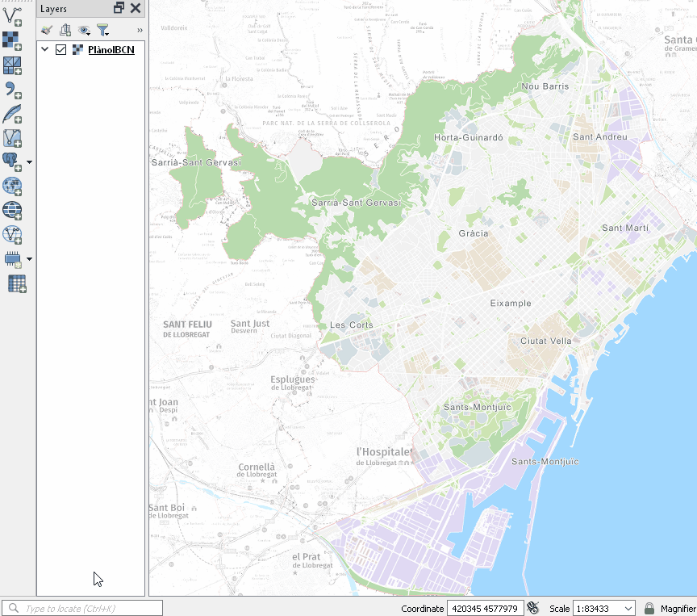
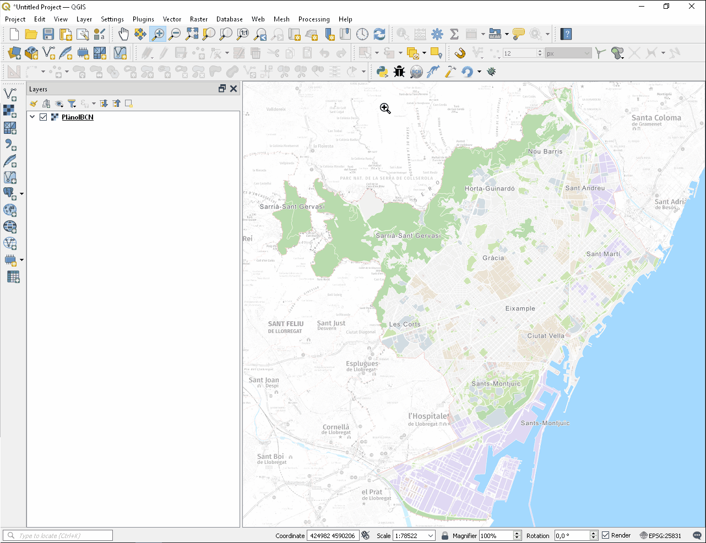
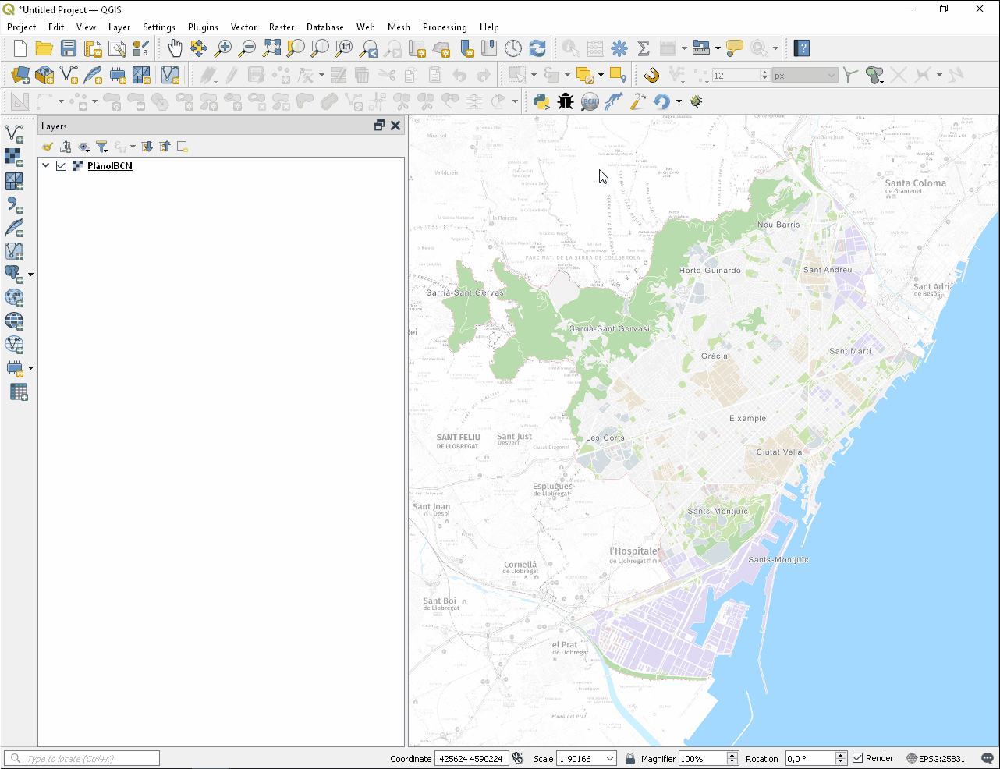

# GeoBarcelona

A QGIS Plugin to search and zoom to any address in Barcelona city

Version 2.0 - June 2022

GNU General Public License version 2 or later

## Table of contents

1. [Overview](#overview)
2. [Quick user guide [EN]](#userguideen)
3. [Guia ràpida de l'usuari [CAT]](#userguidecat)
4. [Guía rápida del usuario [ES]](#userguidees)

## Overview 

[EN] ***GeoBarcelona*** allows to search and zoom to any address in Barcelona city, using the RESTful web service "GeoBcn" (https://w33.bcn.cat/GeoBcn) provided by the Barcelona City Council. Two ways of use:
* Reduced version within the QGIS Locator bar, allowing a quick address search.
* Full version in a docked panel. Allows to search any address by name or by distance from a point clicked at map canvas. The results are displayed with different viewing and downloading options. More features coming.

[CAT] ***GeoBarcelona*** permet cercar i fer zoom a qualsevol adreça de la ciutat de Barcelona, utilitzant el servei web RESTful "GeoBcn" (https://w33.bcn.cat/GeoBcn) proporcionat per l'Ajuntament de Barcelona. Dues formes d'utilitzar-lo:
* Versió reduida dins la barra de cerca de QGIS, permetent fer una cerca ràpida d'adreça.
* Versió completa en panell integrat. Permet cercar qualsevol adreça per nom o per distància a un punt clicat al mapa. Els resultats es mostren amb diferents opcions de visualització i descàrrega. Està previst afegir-hi més funcionalitats.

[ES] ***GeoBarcelona*** permite buscar y hacer zoom a cualquier dirección de la ciudad de Barcelona, utilizando el servicio web RESTful "GeoBcn" (https://w33.bcn.cat/GeoBcn) proporcionado por el Ayuntamiento de Barcelona. Dos formas de uso:
* Versión reducida dentro de la barra de búsqueda de QGIS, permitiendo una búsqueda rápida de dirección.
* Versión completa en panel integrado. Permite buscar cualquier dirección por nombre o por distancia a un punto clicado en el mapa. Los resultados se muestran con diferentes opciones de visualización y descarga. Está previsto añadir más funcionalidades.

## Quick user guide [EN] 

1. ### Searching addresses via QGIS Locator bar

    Simplest and fastest way to search and locate an address. Click on the QGIS locator bar (bottom-left corner) and type an address. Note that simpler addresses give faster results, e.g, "Aragó 44" instead of "C/ Aragó, 44". Double click on desired address for locate it on the map. The address is highlighted during 15 seconds.
    

2. ### Searching addresses via plugin panel

   * #### Search by address

        Open the panel in "Address search" tab and type an address. Note that simpler addresses give faster results, e.g, "Aragó 44" instead of "C/ Aragó, 44". Click on the address desired to locate it. Browsing the table allows to get the rendering of the different administrative units of the address.
        

   * #### Search by distance to clicked point on map

        Open the panel in "Reverse address search" tab and click the button to start capturing addressess. Click any point on the map and wait to get the results. The results are shown in two tables: a table with the information of the clicked point and a table with the addresses found in 100m radius from the clicked point. All the addresses found are rendered at once. Like in "Address search" tab, browsing the table allows to get the rendering of the different administrative units of the address.
        

   * #### Address export

        It's possible to export the addresses found to a default temporary layer. Just click on the  icon to save it. When changing the name of this temporary layer, another layer with the default name  will be created for the next saved address. In "Reverse address search" tab is possible to save all results at once by clicking the "Save all addresses" button. Duplicated addresses are not saved again.

   * #### Complementary services

        When an address is found, it's possible to link it with a different external services:

        *  Google Maps
        *  Google Street View
        *  Spanish Cadastral Electronic Site

3. ### Specifications and limitations of the "GeoBcn" RESTful web service

    * CRS: all the information is provided in ETRS89/UTM zone 31N (EPSG:25831). The reprojection to the project CRS is done automatically.
    * All the queries return a maximum of 25 results.

## Guia ràpida de l'usuari [CAT] 

1. ### Cerca d'adreces mitjançant la barra de cerca de QGIS

    La forma més senzilla i ràpida de cercar i localitzar una adreça. Feu clic a la barra de cerca de QGIS (cantonada inferior esquerra) i escriviu una adreça. Tingueu en compte que les adreces més senzilles donen resultats més ràpids, per exemple, "Aragó 44" en lloc de "C/ Aragó, 44". Feu doble clic a l'adreça desitjada per localitzar-la al mapa. L'adreça es destaca durant 15 segons.
    

2. ### Cerca d'adreces mitjançant el panell del connector

   * #### Cerca per adreça

        Obriu el panell a la pestanya "Cerca adreces" i escriviu una adreça. Tingueu en compte que les adreces més senzilles donen resultats més ràpids, per exemple, "Aragó 44" en lloc de "C/ Aragó, 44". Feu clic a l'adreça desitjada per localitzar-la. La navegació per la taula permet obtenir la representació de les diferents unitats administratives de l'adreça.
        

   * #### Cerca per distància fins al punt clicat al mapa

        Obriu el panell a la pestanya "Cerca inversa d'adreces" i feu clic al botó per començar a capturar adreces. Feu clic a qualsevol punt del mapa i espereu a obtenir els resultats. Els resultats es mostren en dues taules: una taula amb la informació del punt clicat i una taula amb les adreces trobades en un radi de 100m des del punt clicat. Totes les adreces trobades es representen alhora. Com a la pestanya "Cerca adreces", navegar per la taula permet obtenir la representació de les diferents unitats administratives de l'adreça.
        

   * #### Exportació d'adreces

        És possible exportar les adreces trobades a una capa temporal predeterminada. Només cal que feu clic a la icona  per desar-la. En canviar el nom d'aquesta capa temporal, es crearà una altra capa amb el nom predeterminat per a la següent adreça desada. A la pestanya "Cerca inversa d'adreces" és possible desar tots els resultats alhora fent clic al botó "Desa totes les adreces". Les adreces duplicades no es tornen a desar.

   * #### Serveis complementaris

        Quan es troba una adreça, és possible enllaçar-la amb diferents serveis externs:

        *  Google Maps
        *  Google Street View
        *  Seu Electrònica del Cadastre (Espanya)

3. ### Especificacions i limitacions del servei web RESTful "GeoBcn"

    * SRC: tota la informació es proporciona en ETRS89/UTM zona 31N (EPSG:25831). La reprojecció al CRS del projecte es fa automàticament.
    * Totes les consultes retornen un màxim de 25 resultats.

## Guía rápida del usuario [ES] 

1. ### Búsqueda de direcciones a través de la barra búsqueda de QGIS

    La forma más sencilla y rápida de buscar y localizar una dirección. Haga clic en la barra de búsqueda de QGIS (esquina inferior izquierda) y escriba una dirección. Tenga en cuenta que las direcciones más simples dan resultados más rápidos, por ejemplo, "Aragó 44" en lugar de "C/ Aragó, 44". Haga doble clic en la dirección deseada para ubicarla en el mapa. La dirección se resalta durante 15 segundos.
    

2. ### Búsqueda de direcciones a través del panel del complemento

   * #### Búsqueda por dirección

        Abra el panel en la pestaña "Busca direcciones" y escriba una dirección. Tenga en cuenta que las direcciones más simples dan resultados más rápidos, por ejemplo, "Aragó 44" en lugar de "C/ Aragó, 44". Haga clic en la dirección deseada para localizarla. Navegar por la tabla permite obtener la representación de las diferentes unidades administrativas de la dirección.
        

   * #### Búsqueda por distancia al punto clicado en el mapa

        Abra el panel en la pestaña "Búsqueda inversa de direcciones" y haga clic en el botón para comenzar a capturar direcciones. Haga clic en cualquier punto del mapa y espere a obtener los resultados. Los resultados se muestran en dos tablas: una tabla con la información del punto clicado y una tabla con las direcciones que se encuentran en un radio de 100m desde el punto clicado. Todas las direcciones encontradas se representan a la vez. Al igual que en la pestaña "Busca direcciones", navegar por la tabla permite obtener la representación de las diferentes unidades administrativas de la dirección.
        

   * #### Exportación de direcciones

        Es posible exportar las direcciones encontradas a una capa temporal predeterminada. Simplemente haga clic en el icono  para guardarla. Al cambiar el nombre de esta capa temporal, se creará otra capa con el nombre predeterminado para la siguiente dirección guardada. En la pestaña "Búsqueda inversa de direcciones" es posible guardar todos los resultados a la vez haciendo clic en el botón "Guarda todas las direcciones". Las direcciones duplicadas no se vuelven a guardar.

   * #### Servicios complementarios

        Cuando se encuentra una dirección, es posible vincularla con diferentes servicios externos:

        *  Google Maps
        *  Google Street View
        *  Sede Electrónica del Catastro (España)

3. ### Especificaciones y limitaciones del servicio web RESTful "GeoBcn"

    * SRC: toda la información se proporciona en ETRS89/UTM zona 31N (EPSG:25831). La reproyección al SRC del proyecto se realiza automáticamente.
    * Todas las consultas devuelven un máximo de 25 resultados.